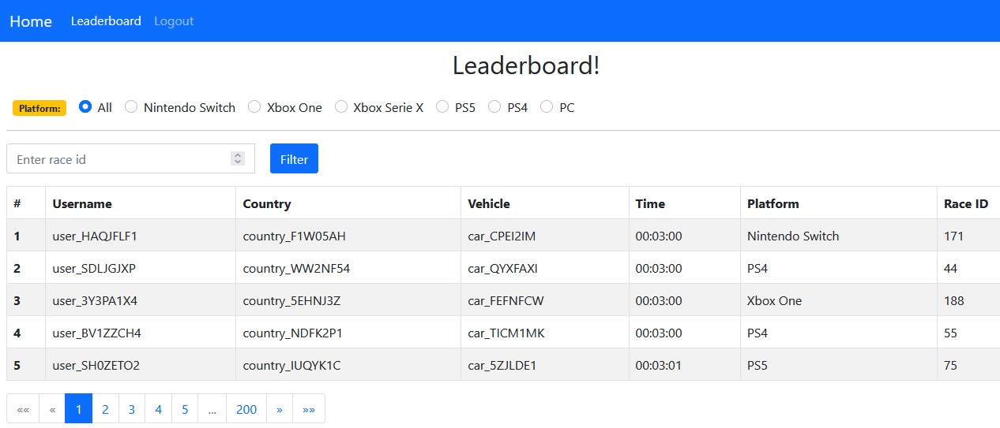

This is the client of [this backend project](https://github.com/masoudarvishian/game-leaderboards-backend). It's a Leaderboard :)

# Running the Client Project

I’ve used Angular 8 framework for the client application. There’s nothing special about the
client, I’ve used `auth guard`, `interceptor` and different `components`, `models`, `services` to interact with the
server side.

In order to run the client, open the `constants.ts` file and make sure `BASE_URL` value is sync with server
address. After that, just run `npm install` command in the root of the project, and then run `ng serve`
command to run the project on port `4200`.

Then you can work with client and see the leaderboard and other related stuff. 

Here is the picture leaderboard page:

